# Introduction
**BetterRTX** is the first Ray Tracing shader mod created for Minecraft's Bedrock Edition (Win 10/11). It is a communal effort to fix and improve upon the rendering features already present within Minecraft's official Ray Tracing implementation. 

The project was created by a voluntary team brought together by the shared goal of giving Minecraft RTX the care it deserves, which Mojang does not provide. It works through a decompile/edit/recompile process where the decompiled shader code is improved and then recompiled to be injected back into the game files.

At the moment, the team consists of two developers, several playtesters and a release manager. Myself and the other developer consistently pushed new fixes and rendering features as the mod progressed, after which the playtesters provided feedback on both the visuals and performance on a wide range of devices. Testing was conducted with GPUs from Nvidia, Intel and AMD to determine the viability of the feature additions with our performance goals in mind. In its current state, BetterRTX has a near-negligible effect on performance in most cases.

Due to the nature of the mod's creation process, the source code likely contains a sizeable portion of Minecraft's original shader code (even despite the inconsistencies that our decompiling process introduces), so publishing it on GitHub may lead to a DMCA takedown. It is for this reason that I am instead creating a repository that provides an overview of the major additions BetterRTX brings to the game, along with some snippets of the code used to implement the new features. 

# New Features:
## Sun and Shadows:
Various improvements to sun lighting have been introduced. The first of these improvements is in the azimuth and zenith of the sun's path throughout the day. Previously, the sun traveled along a path parallel to the world, leading to poor shading of block surfaces at nearly all times of the day. This directly led to poor visuals at noon, due to the apparent lack of shadows present. **BetterRTX** offsets the azimuth and zenith to avoid any situations where the sun is directly overhead. This is achieved through a matrix rotation of the `directionToSun` variable made available through the view buffer. The rotation is optionally invertible as it is used to change the direction of the sun's texture.
```cpp
float3 rotateBySunAngle(float3 dir, bool inverse = false)
{
	float a = inverse ? -SUN_ZENITH : SUN_ZENITH;
	float b = inverse ? -SUN_AZIMUTH : SUN_AZIMUTH;
	matrix<float, 3, 3> zenith =
	{
		1.0, 0.0,     0.0,
		0.0, cos(a), -sin(a),
		0.0, sin(a),  cos(a),
	};
	matrix<float, 3, 3> azimuth =
	{
		 cos(b), 0.0,  sin(b),
		 0.0,    1.0,  0.0,
		-sin(b), 0.0,  cos(b),
	};
	return inverse ? mul(zenith, mul(azimuth, dir)) : mul(azimuth, mul(zenith, dir));
}
```
| Vanilla at Noon | BetterRTX at Noon |
| :-: | :-: |
| 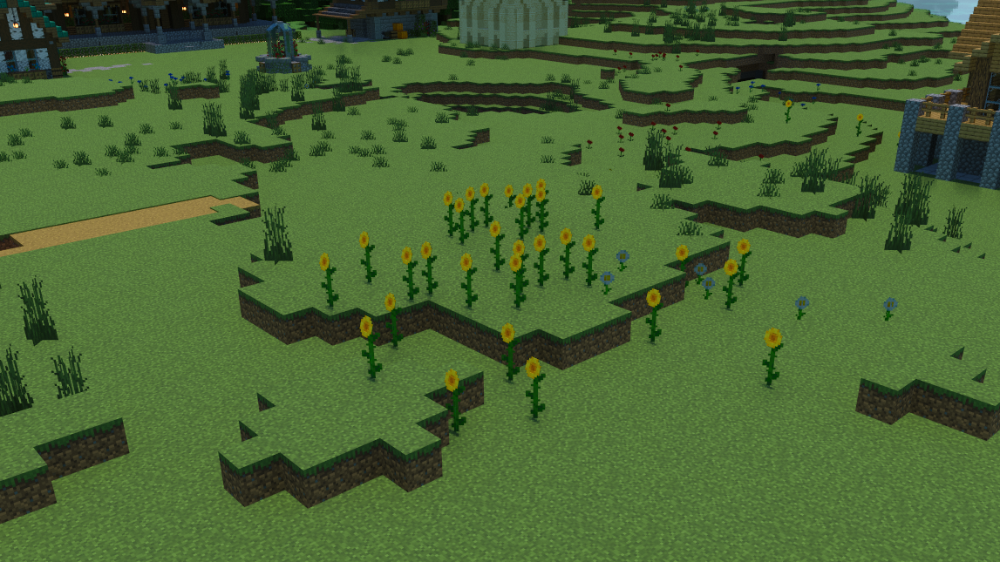 | 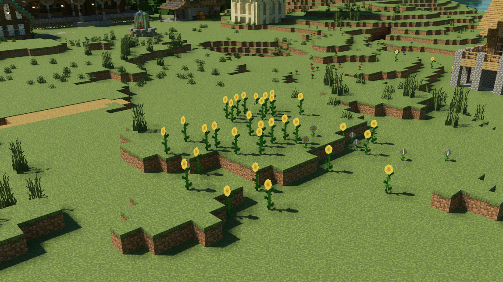 |

Sun shadow clarity has also been heavily improved, through both reducing the sun's sampling radius and improving shadow filtering behaviours. 
| Vanilla Sun Shadows | BetterRTX Sun Shadows |
| :-: | :-: |
|  | 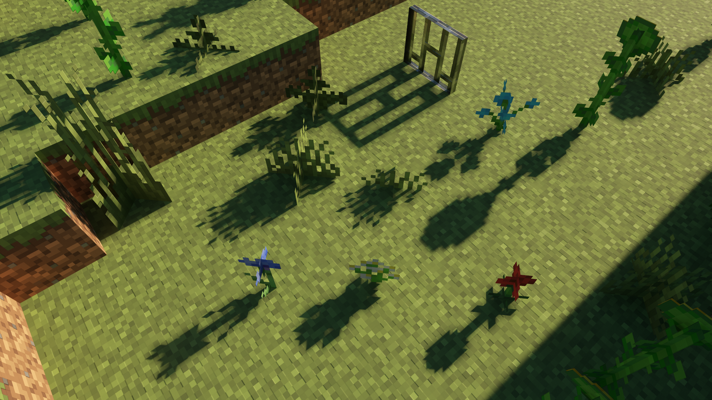 |

## Revamped Atmosphere:
Previously, the atmosphere visuals were achieved by projecting a texture onto the sky and slowly animating it throughout a day/night cycle, with each frame corresponding to a different time of day. This approach exhibited several caveats. Due to the low resolution of the texture (64x32 per frame), artifacts such as colour banding were prevalent throughout the sky. There were even some downscaling artifacts between frames, with colour from one bleeding into the next (leading to a dark dot near the zenith). **BetterRTX** solves all of these issues through introducing a physically based simulation of Rayleigh and Mie scattering to render the atmosphere.
| Vanilla at Dawn | BetterRTX at Dawn |
| :-: | :-: |
| 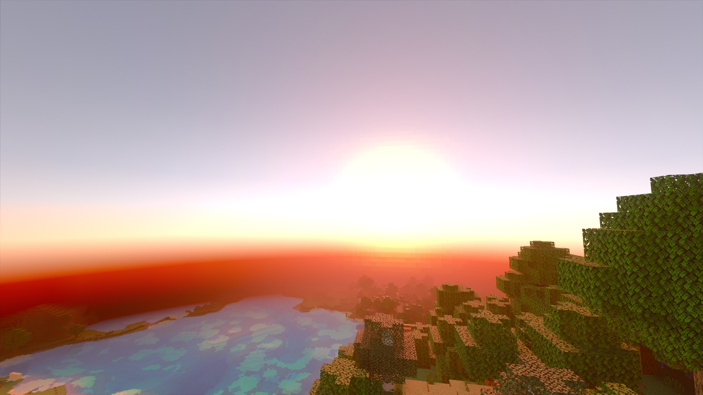 | 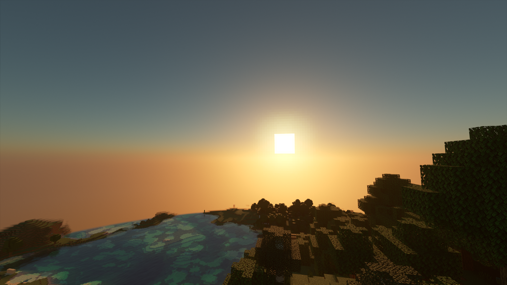 |

The apparent brightness of the sky has also decreased, since before BetterRTX luminance from the atmosphere was not sampled when determining exposure value.

## Water Parallax Mapping:
The previous water rendering method has been widely considered lackluster by the community, as it relies solely on an animated normal map in order to exhibit the notion of waving water. The visual presentation of this effect is hindered even more through the poorly implemented LOD system in place: normal mapping stops applying to the surface of water at a disappointingly short distance from the camera. This led to water appearing completely static in most camera positions. **BetterRTX** includes several improvements to water directly addressing these issues. The height of water is now varied over time through multiple noise samples and visually displaced through a parallax mapping technique. Reflection quality has also been significantly improved through additions to the specular denoiser.
```cpp
float calcWaterSurfaceHeight(float3 stepPos)
{
	float dist = length(stepPos);
	stepPos -= g_view.waveWorksOriginInSteveSpace;
	stepPos.z *= 2.0;
	float t = (g_view.time * WATER_PARALLAX_SPEED_MULTIPLIER) % 256.0;
	float n = noise3(float3(stepPos.xz * WATER_PARALLAX_FREQUENCY + t, t * 0.75));
	if (dist < 68)
	{
		float n2 = noise3(float3(stepPos.xz * WATER_PARALLAX_FREQUENCY * 2.0 + t, t * 0.75)) * 0.5;
		n = lerp(n + n2, n, smoothstep(60.0, 68.0, dist));
	}
	if (dist < 34)
	{
		float n2 = noise3(float3(stepPos.xz * WATER_PARALLAX_FREQUENCY * 4.0 + t, t * 0.75)) * 0.25;
		n = lerp(n + n2, n, smoothstep(30.0, 34.0, dist));
	}
	return (2.0 * n * (4.0 / 7.0) - 1.0) * WATER_PARALLAX_AMPLITUDE;
}
```
| Vanilla Water | BetterRTX Water |
| :-: | :-: |
| 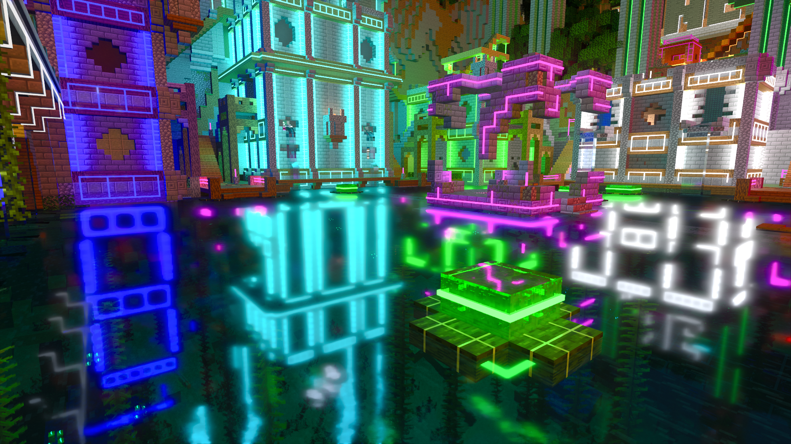 |  |

## Rain Puddles:
During weather events such as rainfall, Minecraft RTX only employed one additional visual effect: the sky would transition from its normal colour to uniform grey. **BetterRTX** takes much better advantage of Ray Traced rendering to greatly improve the visuals during rainfall. The mod adds increased volumetric fog during rainy weather, and implements puddles through mapping a noise function to the terrain. A ray is traced upwards from the puddle surface with a random offset to determine if the sky is reachable, in order to naturally transition from wet to dry spaces under rain-blocking geometry.
```cpp
float wetness = 0.0;
bool isSurfaceFacingUpward = false;
float rainLevel = getBiomeAdjustedRainLevel();
if (rainLevel > 0.0 && objectCategory != OBJECT_CATEGORY_WATER && dot(geometryInfo.normal, float3(0.0, -1.0, 0.0)) <= 0.01)
{
	// send a ray upwards, sampled from a disk, to see if the surface should be wet
	float2 u = loadBlueNoise2(1, 0, geometryInfo.uv * 65536.0);
	float2 diskSample = sample_cosine_hemisphere_polar(u).xy * RAIN_SAMPLE_DISK_RADIUS;
	float3 sampleDirection = normalize(float3(diskSample.x, 1.0, diskSample.y));

	RayDesc ray;
	ray.Origin = offset_ray(geometryInfo.position, geometryInfo.normal);
	ray.Direction = sampleDirection;
	ray.TMin = MIN_PRIMARY_DISTANCE;
	ray.TMax = MAX_SECONDARY_DISTANCE;
	HitInfo hitInfo;
	TraceGenericRay(RAY_FLAG_NONE, INSTANCE_MASK_SHADOW, false, ray, hitInfo);

	if (!hitInfo.hasHit())
	{
		float noise = 1.0;
		isSurfaceFacingUpward = dot(geometryInfo.normal, float3(0.0, 1.0, 0.0)) > 0.5;
		if (isSurfaceFacingUpward && objectInstance.flags & kObjectInstanceFlagChunk)
		{
			float3 noiseCoord = (geometryInfo.position - g_view.waveWorksOriginInSteveSpace) / RAIN_PUDDLE_SCALE;
			noise = smoothstep(NOISE_MIN_THRESHOLD, NOISE_MAX_THRESHOLD, noise3(noiseCoord));
		}
		wetness = rainLevel * noise * RAIN_WETNESS_MULTIPLIER;
		surfaceInfo.linearRoughness = lerp(surfaceInfo.linearRoughness, PUDDLE_ROUGHNESS, max(rainLevel * UNIFORM_WETNESS, wetness));
		surfaceInfo.colour *= lerp(1.0, PUDDLE_COLOUR_REDUCTION, wetness);
		surfaceInfo.metalness *= lerp(1.0, PUDDLE_METALNESS_REDUCTION, wetness);
	}
}
```
| Vanilla Rainfall | BetterRTX Rainfall |
| :-: | :-: |
| 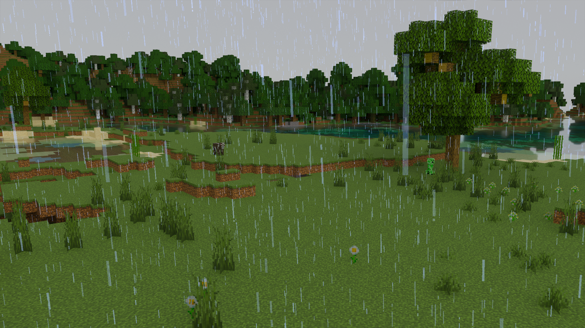 | 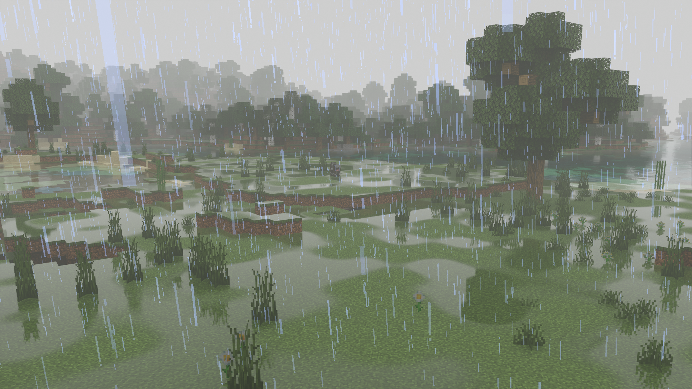 |

## Reflected Water Caustics:
**BetterRTX** introduces water caustics through sunlight reflections off of water to enhance the level of realism achieved with the renderer. From each point on a surface, the path sunlight would take to reflect off of water is traced backward to determine if reflected sunlight is capable of reaching that point. If so, the animated caustics texture is sampled and added to the illuminance of the surface.
```cpp
float3 sampleReflectedCaustics(float3 origin, float3 normal, float3 directionToSun)
{
	float3 transmission = 0..xxx;
	const float3 waterTestRayDirection = -reflect(-directionToSun, float3(0.0, 1.0, 0.0));
	if (dot(waterTestRayDirection, normal) > 0.0)
	{
		RayDesc waterTestRay;
		waterTestRay.Origin = offset_ray(origin, normal);
		waterTestRay.Direction = waterTestRayDirection;
		waterTestRay.TMin = 0.f;
		waterTestRay.TMax = REFLECTED_WATER_CAUSTICS_CUTOFF;
		HitInfo waterTestRayHitInfo;
		TraceGenericRay(RAY_FLAG_NONE, INSTANCE_MASK_SECONDARY, false, waterTestRay, waterTestRayHitInfo);
		if (waterTestRayHitInfo.hasHit() && waterTestRayHitInfo.GetObjectCategory() == OBJECT_CATEGORY_WATER)
		{
			RayDesc shadowTestRay;
			shadowTestRay.Origin = mad(waterTestRayDirection, waterTestRayHitInfo.hitT, waterTestRay.Origin);
			shadowTestRay.Direction = directionToSun;
			shadowTestRay.TMin = 0.001;
			shadowTestRay.TMax = MAX_SECONDARY_DISTANCE;
			HitInfo shadowTestRayHitInfo;
			TraceGenericRay(RAY_FLAG_NONE, INSTANCE_MASK_SHADOW & ~INSTANCE_MASK_WATER, false, shadowTestRay, shadowTestRayHitInfo);
			ObjectInstance objectInstance = objectInstances[shadowTestRayHitInfo.GetInstanceIdx()];
			if (!shadowTestRayHitInfo.hasHit() || objectInstance.flags & kObjectInstanceFlagClouds)
				transmission = calcReflectedWaterCaustics(shadowTestRay.Origin, waterTestRayHitInfo.hitT).xxx;
		}
	}
	return transmission;
}
```
| Vanilla | BetterRTX |
| :-: | :-: |
| 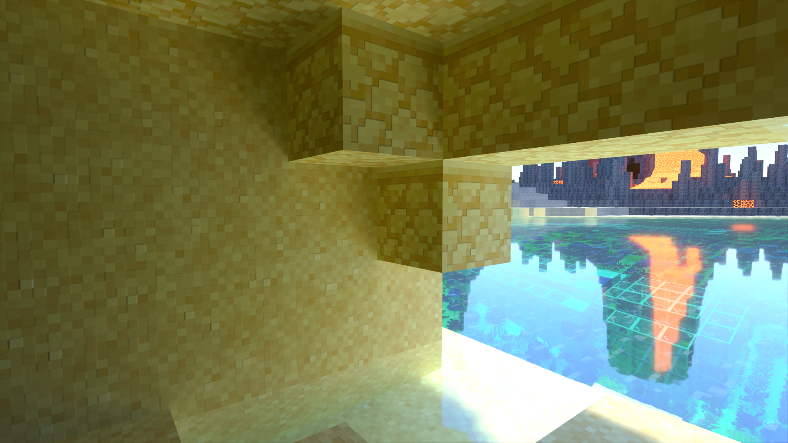 | 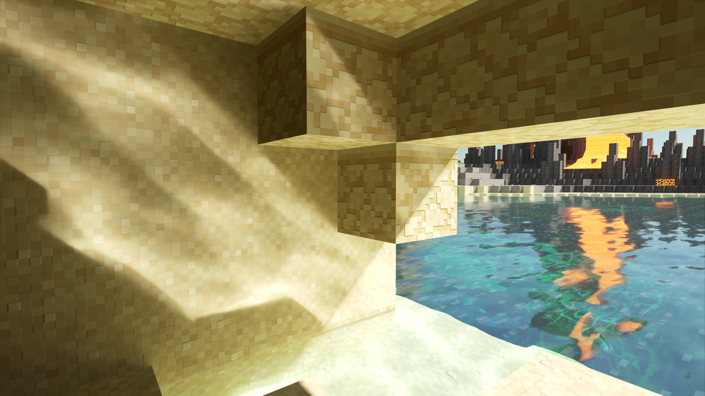 |

## Motion Blur:
After a bit of research into different methods of implementing the feature, I based my implementation of motion blur on the method outlined in Nvidia's [GPU Gems 3](https://developer.nvidia.com/gpugems/gpugems3/part-iv-image-effects/chapter-27-motion-blur-post-processing-effect), and modified it with a custom weighted average. The motion vectors are pulled from the existing buffer, and are then used as the path that each colour sample is taken from for use in the final average. To make the blur respond to different magnitudes and directions of motion, I weighed each colour sample across the pixel path by its unique motion vector projected onto the origin pixel's motion vector. This prevents pixels undergoing significant motion from sampling static pixels for motion blur. Motion blur intensity is made inversely proportional to the current frame time to make the perceived motion blur intensity remain the same no matter the current framerate.
```cpp
// Get motion vector UV for this pixel
float2 motionUv = inputBufferMotionVectors[ipos];
// Full intensity at MOTION_BLUR_TARGET_FRAMETIME, make intensity inversely proportional to frametime
float frameTimeFactor = MOTION_BLUR_TARGET_FRAMETIME / frameTime;
// Multiply by display resolution to get velocity in pixels
float2 motionPixels = -motionUv * MOTION_BLUR_INTENSITY * frameTimeFactor * g_view.displayResolution;
// Clamp length to range from 0 to max motion blur length
motionPixels *= saturate(MOTION_BLUR_MAX_LENGTH / length(motionPixels));

// Distribute pixel velocity over sample count
float2 velocity = motionPixels / float(MOTION_BLUR_SAMPLES);
float2 spos = float2(ipos) + velocity;
float mtotalWeight = 1.0;
[unroll] for (uint s = 1; s < MOTION_BLUR_SAMPLES; s++, spos += velocity) {
	if (any(spos <= 0) || any(spos >= g_view.renderResolution)) continue;
	float2 thisMotionUv = inputBufferMotionVectors[round(spos)];
	// Weigh by vector similarity so that motion blur doesn't sample from static areas
	float sampleWeight = saturate(dot(thisMotionUv, motionUv) / dot(motionUv, motionUv));
	mtotalWeight += sampleWeight;

	// Sample the color buffer along the velocity vector
	float3 currentColor = inputThisFrameTAAHistory[round(spos)].rgb;
	// Add the weighted sample to final colour
	finalColour += currentColor * sampleWeight;
}

// Average all of the samples to get the final blur colour
finalColour /= mtotalWeight;
```
Demo Video:
[](http://www.youtube.com/watch?v=vKGCLTsGEak)

## Depth of Field:
Depth of field is achieved through simulating a camera with a circular aperture. Primary ray origins are offset by a random distance within the bounds of the aperture size, and are traced towards a focal point. Focal distance is determined automatically by using the extent of a few primary rays cast from the center of the screen. Over each frame, the current focal distance is slowly incremented towards the target focal distance through a lerp function. Since the path tracer runs at one sample per pixel, rendering the effect with large apertures introduces significant noise. A Gaussian blur is applied to the scene with varying intensity, depending on the distance from the focal point to each primary ray intersection to account for the noise.
```cpp
RayDesc generateThinLensCameraRay(float2 posNdcXy, inout rand_seed randSeed, float focusDistance, float apertureSize) {
	RayDesc ray = generatePinholeCameraRay(posNdcXy);

	float3 focalPoint = ray.Origin + ray.Direction * focusDistance;

	float3 forwardVector = generatePinholeCameraRay(0).Direction;
	float3 rightVector = float3(1, 0, 0);
	float3 upVector = cross(forwardVector, rightVector);
	rightVector = cross(upVector, forwardVector);

	float2 apertureSample = getApertureSample(randSeed) * apertureSize;

	ray.Origin = ray.Origin + rightVector * apertureSample.x + upVector * apertureSample.y;
	ray.Direction = normalize(focalPoint - ray.Origin);

	return ray;
}
```

Demo Video:
[](http://www.youtube.com/watch?v=3kSjOb7tNYw)

# Bug Fixes:
## Spectator Mode:
Spectator is a game mode within Minecraft meant to provide players with the opportunity to spectate their worlds without interacting with anything. One of the headlining features of the game mode is the ability to see through the back faces of blocks while inside of them, enabling players to see within enclosed spaces without needing to be positioned inside such spaces. This feature unfortunately isn't functional with Ray Tracing by default. **BetterRTX** fixes the issue through a simple check for primary rays, replacing them with new rays placed behind the back faces of blocks should the original ray hit the back face of one.
```cpp
// If this is a primary ray and has hit a surface
if (numBounces == 0 && primaryHitInfo.hasHit()) {
	ObjectInstance objectInstance = objectInstances[primaryHitInfo.GetInstanceIdx()];
	primaryGeometryInfo = GetGeometryInfo(primaryHitInfo, kGeometryModeSingleSided, primaryRay.Direction);
	// If primary ray hits the backside of an opaque block, send another ray behind it's surface to act
	// as the original, then add their ray distances together for reprojection purposes
	if (!primaryGeometryInfo.isFrontFace && objectInstance.objectCategory == OBJECT_CATEGORY_OPAQUE && objectInstance.flags & kObjectInstanceFlagChunk) {
		float hitDist = primaryHitInfo.hitT;
		primaryRay.Origin = offset_ray(primaryGeometryInfo.position, -primaryGeometryInfo.normal);
		TraceGenericRay(cullingFlag, instanceMask, true, primaryRay, primaryHitInfo);
		primaryHitInfo.hitT += hitDist;
	}
}
```
| Vanilla | BetterRTX |
| :-: | :-: |
| 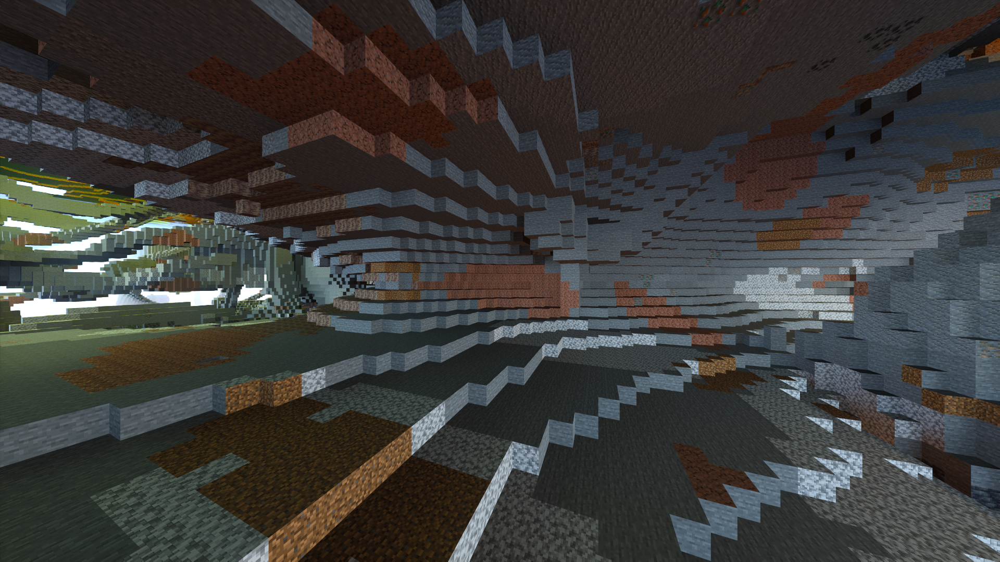 | 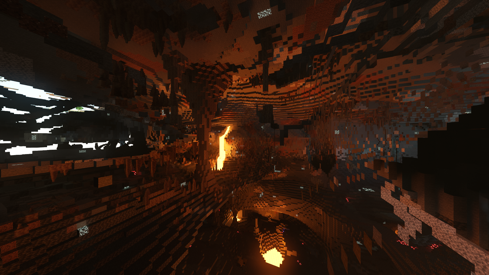 |

## Light Transmission:
Normally within Minecraft, placing any block with an explicit point light (Torches, End Rods, Lanterns) behind glass would fail to properly transmit its light through coloured materials. Emissive surfaces fail to properly transmit their emission in reflections as well. **BetterRTX** introduces a few changes that properly implement these missing features.
| Vanilla | BetterRTX |
| :-: | :-: |
| 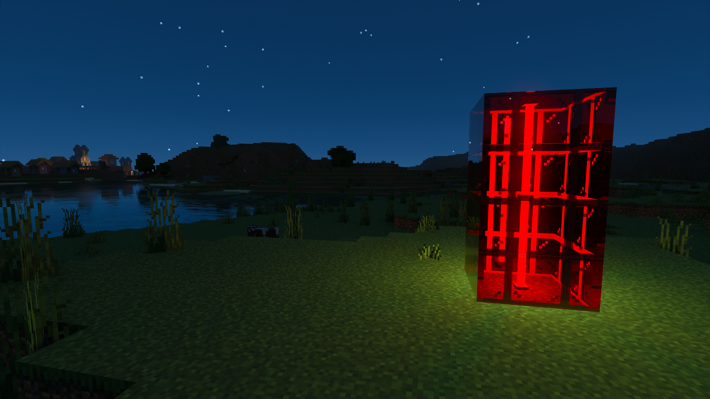 | 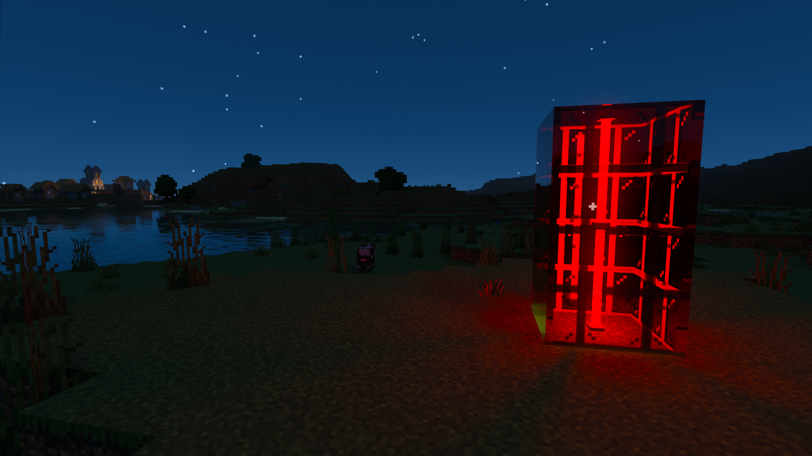 |
| 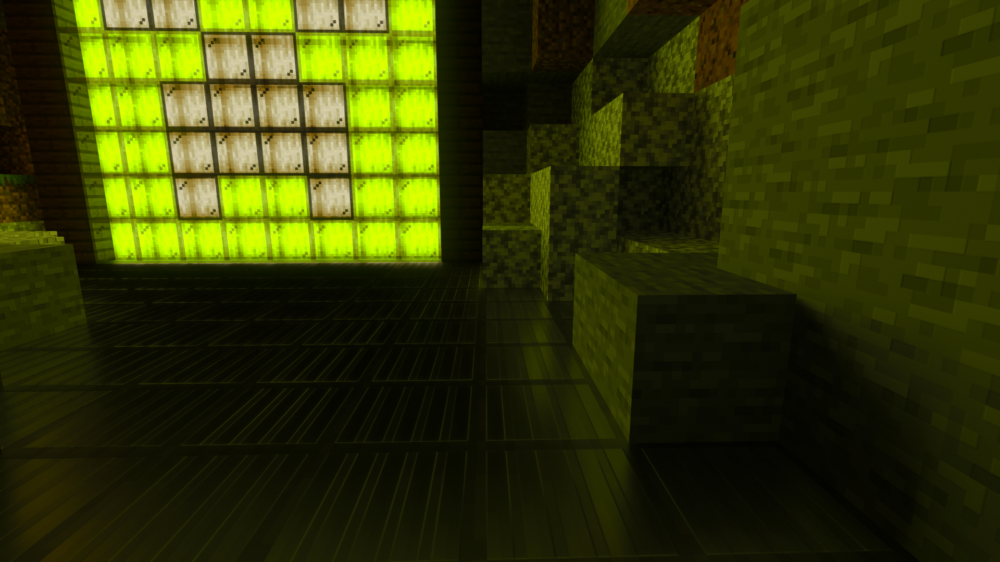 | 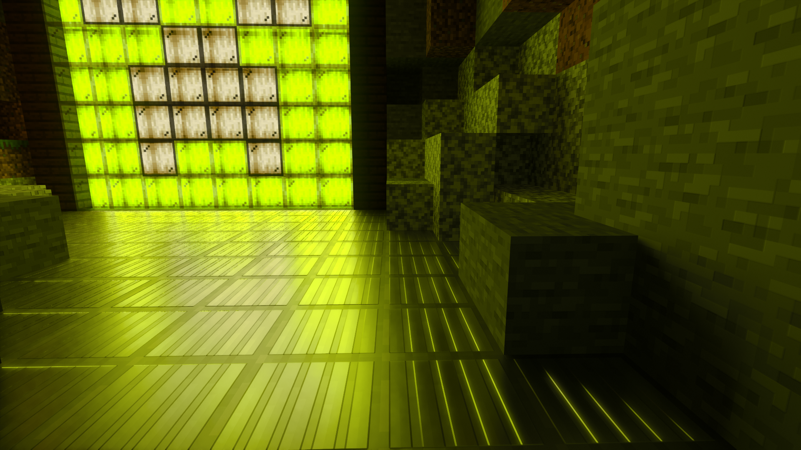 |

## Status Effects:
The fog used by the darkness and blindness effects leaves a lot to be desired. Skylight leaks through the fog in both specular reflections and in transmission through water, ruining any sense of immersion these status effects could provide. The Darkness effect also failed to include the iconic exposure pulses present outside of the Ray Traced renderer. **BetterRTX** solves all of these issues, by properly implementing the fog gained from these effects into both specular reflections and in light transmission, making sure to implement period exposure pulses while under the Darkness effect to match the feature present in the rasterized Minecraft renderer.

Demo Video:
[](http://www.youtube.com/watch?v=TVbaB-LQ1-g&t=43s)