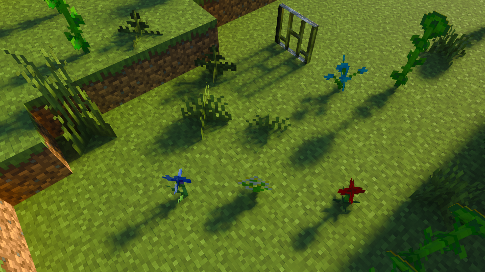

# Introduction
**BetterRTX** is the first Ray Tracing shader mod created for Minecraft's Bedrock Edition (Win 10/11). It is a communal effort to fix and improve upon the rendering features already present within Minecraft's official Ray Tracing imlementation. 

The project was created a developed by a voluntary team brought together by the shared goal of giving Minecraft RTX the care it deserves, taht which Mojang does not provide. It works through a decompile/edit/recompile process where the decompiled shader code is improved and then recompiled and injected back into the game files.

At the moment, the team consists of two developers, several playtesters and a release manager. As developers, myself and the other programmer consistently pushed new fixes and rendering features as the mod progressed, and the team of playtesters provided feedback on both the visuals and performance on a wide range of devices. Testing was done on GPUs from Nvidia, Intel and AMD in order to determine the viability of many feature additions with our performance goals in mind. In its current state, BetterRTX has a near-negligible effect on performance in most cases.

Due to the nature of the mod's creation process, the source code likely contains a sizeable portion of Minecraft's original shader code (even despite the inconsitencies that our decompiling process introduces), so publishing it on Github may lead to a DMCA takedown. It is for this reason that I am instead creating a repository that provides an overview of the major additions BetterRTX brings to the game, along with some snippets of the code used to implement the new features. 

# New Features:
## Sun and Shadow:
Various improvements to sun lighting have been introduced. The first of these improvements is in the azimuth and zenith of the sun's path throughout the day. Previously, the sun traveled along a path parallel to the world, leading to poor shading of block surfaces at nearly all times of the day. This directly led to poor visuals at noon, due to the apparent lack of shadows present. **BetterRTX** offsets the azimuth and zenith to avoid any situations where the sun is directly overhead. This is achieved through a matrix rotation of the `directionToSun` variable made available through the view buffer. The rotation is optionally invertable as it is used to change the direction of the sun texture.
```cpp
float3 rotateBySunAngle(float3 dir, bool inverse = false)
{
	float a = inverse ? -SUN_ZENITH : SUN_ZENITH;
	float b = inverse ? -SUN_AZIMUTH : SUN_AZIMUTH;
	matrix<float, 3, 3> zenith =
	{
		1.0, 0.0,     0.0,
		0.0, cos(a), -sin(a),
		0.0, sin(a),  cos(a),
	};
	matrix<float, 3, 3> azimuth =
	{
		 cos(b), 0.0,  sin(b),
		 0.0,    1.0,  0.0,
		-sin(b), 0.0,  cos(b),
	};
	return inverse ? mul(zenith, mul(azimuth, dir)) : mul(azimuth, mul(zenith, dir));
}
```
| Vanilla at Noon | BetterRTX at Noon |
| :-: | :-: |
|  |  |

Sun shadow clarity has also been heavily improved, through both reducing the sun's sampling radius and through improving shadow filtering behaviours. 
| Vanilla Sun Shadows | BetterRTX Sun Shadows |
| :-: | :-: |
|  |  |

## Revamped Atmosphere
Previously, the atmosphere visuals were achieved through projecting a texture onto the sky and slowly animating a texture throughout a day/night cycle, with each frame corresponding to a different time of day. This approach exhibited several caveats. Due to the low resolution of the texture (64x32 per frame), artifacts such as colour banding were prevalent throughout the sky. There were even some downscaling artifacts between frames, with colour from one bleeding into the next (leading to a dark dot at the zenith). BetterRTX solves all of these issues through introducing a physically based simulation of rayleigh and mie scattering to render the atmosphere.
| Vanilla at Dawn | BetterRTX at Dawn |
| :-: | :-: |
|  |  |

The percieved brightness of the sky has also decreased, since before BetterRTX luminance from the atmosphere wasn't sampled when determining exposure value.
